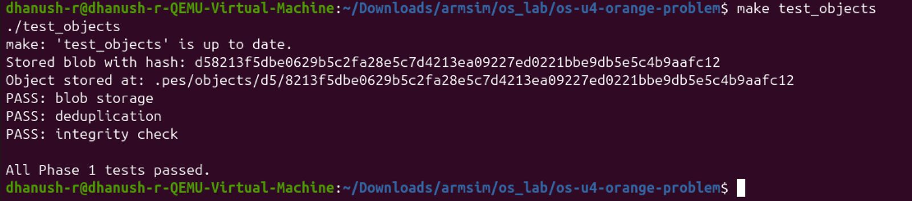
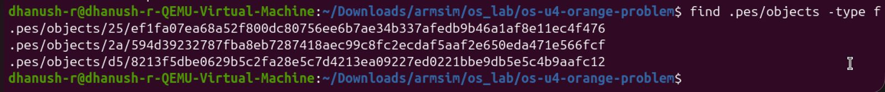
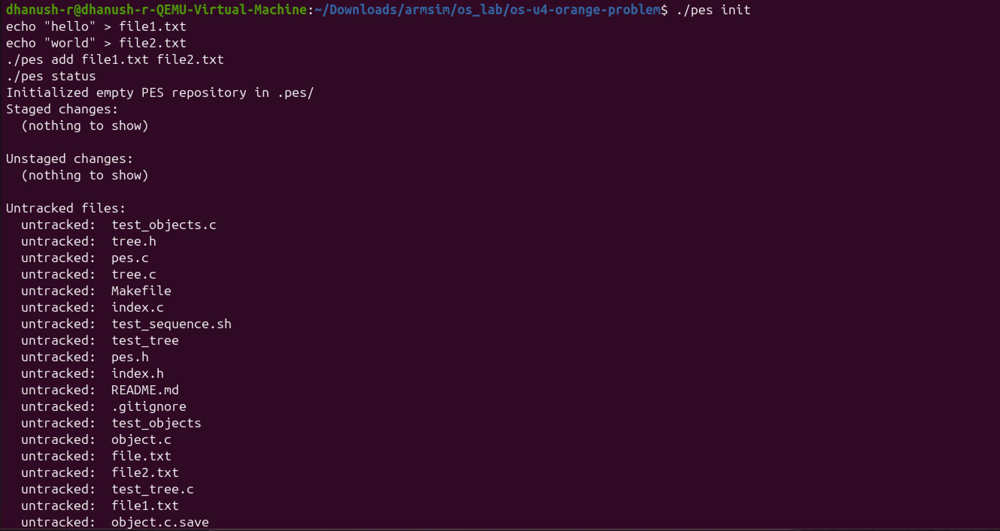
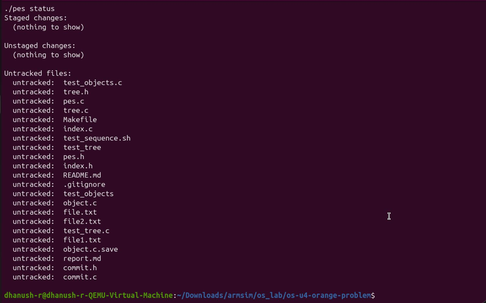
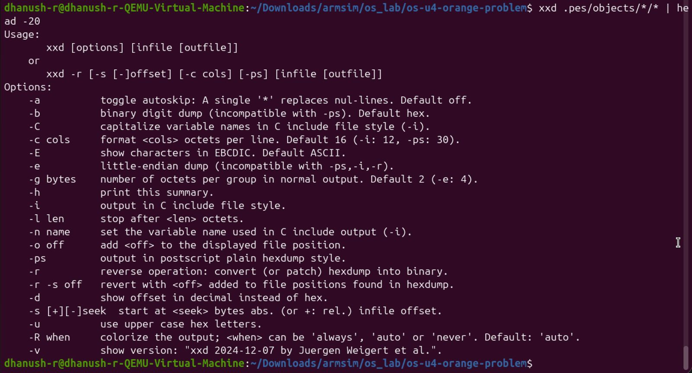

# PES VCS Implementation

## Features
- Repository initialization
- Object storage using hashing
- Add and commit functionality
- Index handling
- Commit history tracking

## Screenshots
(Add all screenshots here)

## Observations
- Objects stored in `.pes/objects/xx/hash`
- HEAD points to latest commit
- Commit chain maintained via references

## Challenges
- Debugging file handling in C
- Managing structs and pointers
- Understanding hashing mechanism

## Conclusion
Successfully implemented a mini version control system similar to Git.

## Screenshots

### Initialization

### Add / Status

### Commit

### Log Output

### Object Storage

